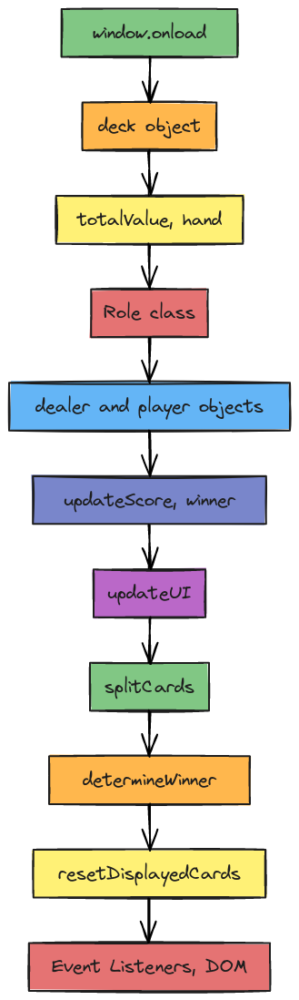

## Detailed Flow Description

### Initialization
- **window.onload**: Initializes the game timer and starts counting the seconds.
- **deck**: Object that contains the deck of cards and functions to reset and select cards.

### Game Functions
- **totalValue(hand)**: Calculates the total value of a given hand.
- **Role class**: Represents a player or dealer, manages their hand and total value.

### Player and Dealer
- Instances of the `Role` class.
- `player` object also includes `splitHands` and `splitTotal` for handling split hands.

### Score and UI Updates
- **updateScore(winner)**: Updates the score of the player or dealer.
- **updateUI()**: Updates the game UI to reflect the current state of hands and scores.

### Game Logic
- **splitCards()**: Handles the logic for splitting the player's cards.
- **determineWinner()**: Determines the winner of the game and updates the UI accordingly.
- **resetDisplayedCards()**: Resets the UI for a new game.

### Event Listeners
- Event listeners for `deal`, `hit`, `stand`, and `split` buttons to handle user interactions.

## Arrows (Data Flow)
- The arrows represent the flow of data between functions and objects. For instance:
  - `deck` -> `selectCardsFromDeck(amount)` -> `player.hand` and `dealer.hand`
  - `player.hand` -> `totalValue(hand)` -> `player.total`
  - `updateUI()` <- `player.hand`, `dealer.hand`, `player.total`, `dealer.total`
  - `determineWinner()` <- `player.total`, `dealer.total` -> `updateScore(winner)` -> `updateUI()`
  - `splitCards()` -> `player.splitHands`, `player.splitTotal` -> `updateUI()`

By following this flow, you can see how the different parts of the game interact with each other, how the data moves between functions, and how the game logic is implemented.

+-----------------------------------------+
|             window.onload               |
|-----------------------------------------|
| Initialize game timer                   |
+-----------------------------------------+
                    |
                    |
                    v
+-----------------------------------------+
|               deck object               |
|-----------------------------------------|
| - rank                                  |
| - suit                                  |
| - remaining                             |
| - resetDeck()                           |
| - selectCardsFromDeck(amount)           |
+-----------------------------------------+
                    |
                    |
                    v
+-----------------------------------------+
|            totalValue(hand)             |
|-----------------------------------------|
| Calculate total value of a hand         |
+-----------------------------------------+
                    |
                    |
                    v
+-----------------------------------------+
|               Role class                |
|-----------------------------------------|
| - constructor(name)                     |
| - addCard(card)                         |
| - hand                                  |
| - total                                 |
+-----------------------------------------+
                    |
                    |
                    v
+-----------------------------------------+
|        dealer and player objects        |
|-----------------------------------------|
| - dealer: instance of Role              |
| - player: instance of Role              |
| - player.splitHands                     |
| - player.splitTotal                     |
+-----------------------------------------+
                    |
                    |
                    v
+-----------------------------------------+
|            updateScore(winner)          |
|-----------------------------------------|
| Update player or dealer score           |
+-----------------------------------------+
                    |
                    |
                    v
+-----------------------------------------+
|               updateUI()                |
|-----------------------------------------|
| Update the game UI                      |
+-----------------------------------------+
                    |
                    |
                    v
+-----------------------------------------+
|              splitCards()               |
|-----------------------------------------|
| Handle splitting of player's cards      |
+-----------------------------------------+
                    |
                    |
                    v
+-----------------------------------------+
|          determineWinner()              |
|-----------------------------------------|
| Determine and display the winner        |
+-----------------------------------------+
                    |
                    |
                    v
+-----------------------------------------+
|             resetDisplayedCards()       |
|-----------------------------------------|
| Reset the UI for a new game             |
+-----------------------------------------+
                    |
                    |
                    v
+-----------------------------------------+
|          Event Listeners (DOM)          |
|-----------------------------------------|
| - deal-button                           |
| - hit-button                            |
| - stand-button                          |
| - split-button                          |
+-----------------------------------------+
                    |
                    |
                    v
+-----------------------------------------+
|        Main Game Logic Flow             |
|-----------------------------------------|
| - Deal initial cards                    |
| - Handle player actions                 |
| - Handle dealer actions                 |
| - Determine winner                      |
+-----------------------------------------+
